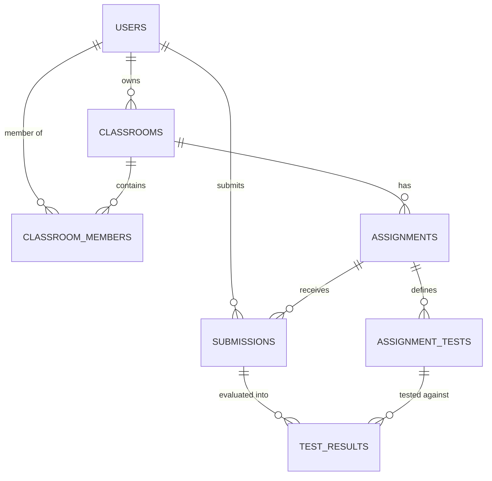
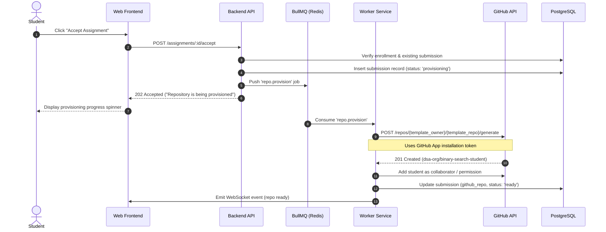

# AGENT.md — Project Specification & Agent Blueprint: Classroom Autograding Platform

> **System Blueprint & Operating Instructions for AI Agents & Developers**
>
> This document defines the system architecture, domain models, execution workflows, API contracts, grading pipelines, and step-by-step roadmap for building the **Classroom** platform — an open-source, production-grade GitHub Classroom alternative and distributed online code evaluation judge.

---

## 1. Project Overview & Objectives

**Classroom** is an automated educational platform that bridges GitHub repository management with an automated testing and grading engine. It enables instructors to manage classrooms, generate individualized student assignment repositories from templates, track student commits, capture push webhooks, and evaluate code submissions via GitHub Actions or an isolated Docker sandbox.

### Core Goals
- **Seamless GitHub Integration**: GitHub OAuth for user identity and a GitHub App for organizational repo creation, webhook management, and pull request feedback.
- **Asynchronous Reliability**: Heavy tasks (repository provisioning, commit grading, sandbox execution) are offloaded to Redis + BullMQ workers to keep API response times < 100ms.
- **Two-Tier Grading Engine**:
  - **Tier 1 (MVP)**: Lightweight autograding powered by GitHub Actions.
  - **Tier 2 (Advanced)**: Distributed, isolated Docker sandbox judge (secure container execution with CPU, memory, timeout, and network constraints).
- **Comprehensive Educator Dashboard**: Live visibility into student progress, pass/fail status, test outputs, execution logs, and commit history.

---

## 2. System Architecture

### High-Level Architecture Diagram

```
                           ┌─────────────────────┐
                           │      Frontend       │
                           │   Next.js / React   │
                           └──────────┬──────────┘
                                      │
                                      │ HTTPS
                                      ▼
                           ┌─────────────────────┐
                           │     Backend API     │
                           │ Express / Nest / TS │
                           └──────────┬──────────┘
                                      │
                 ┌────────────────────┼─────────────────────┐
                 │                    │                     │
                 ▼                    ▼                     ▼
        ┌────────────────┐   ┌────────────────┐   ┌────────────────┐
        │   PostgreSQL   │   │     Redis      │   │   GitHub App   │
        │  (Drizzle ORM) │   │                │   │                │
        │ users          │   │ cache          │   │ GitHub API     │
        │ classrooms     │   │ jobs           │   │ repos          │
        │ assignments    │   │ rate limits    │   │ orgs           │
        │ submissions    │   └───────┬────────┘   │ webhooks       │
        └────────────────┘           │            └───────┬────────┘
                                     │                    │
                                     ▼                    ▼
                              ┌──────────────┐       GitHub Webhook
                              │  Job Queue   │       (push / PR)
                              │   BullMQ     │
                              └──────┬───────┘
                                     │
                             ┌───────▼────────┐
                             │ Worker Service │
                             │                │
                             │ create repos   │
                             │ run grading    │
                             │ sync commits   │
                             └───────┬────────┘
                                     │
                        ┌────────────┴───────────┐
                        ▼                        ▼
                GitHub Actions             Docker Sandbox
                based grading             isolated judge
```

### Final Production Topology

```
                           Internet
                              │
                              ▼
                         Cloudflare
                              │
                  ┌───────────┴────────────┐
                  ▼                        ▼
             Next.js App               Backend API
                                         │
                  ┌──────────────────────┼─────────────────────┐
                  │                      │                     │
                  ▼                      ▼                     ▼
            PostgreSQL                Redis                GitHub App
         (Drizzle ORM)                 │                     │
               │                       ▼                     │
               │                   Job Queue                 │
               │                    (BullMQ)                 │
               │                       │                     │
               │                 ┌─────┴─────┐              │
               │                 ▼           ▼              │
               │             Worker 1    Worker 2           │
               │                 │           │              │
               │                 ▼           ▼              │
               │             Docker      Docker             │
               │             Sandbox     Sandbox            │
               │                                             │
               └──────────────────────┬──────────────────────┘
                                      │
                                      ▼
                                    GitHub
                                      │
                                  Webhooks
                                      │
                                      ▼
                                 Backend API
```

---

## 3. Technology Stack & Key Decisions

| Layer | Choice | Rationale |
| :--- | :--- | :--- |
| **Frontend** | **Next.js (App Router)** + TypeScript + Tailwind CSS | Fast SSR/SSG, intuitive routing, modern component ecosystem. |
| **Backend API** | **Node.js + TypeScript** (Express or NestJS) | Modular monolith architecture; keeps domain boundaries clean and scalable. |
| **Database** | **PostgreSQL** + **Drizzle ORM** | Type-safe schema definition, lightweight runtime footprint, zero-codegen drift. |
| **Cache & Queues**| **Redis** + **BullMQ** | Resilient background job queueing, rate limiting, and failure retry handling. |
| **Git & Hosting** | **GitHub App** | Org-level installation, fine-grained repository permissions, webhook delivery without user token pollution. |
| **Auth** | **GitHub OAuth 2.0** + JWT / HTTP-only Cookies | Frictionless login for students/teachers; matches developer persona. |
| **Grading (Tier 1)**| **GitHub Actions** | Zero-infrastructure autograding triggered directly on student commits. |
| **Grading (Tier 2)**| **Docker Sandbox** | Controlled execution sandbox with resource ceilings (CPU: 1, RAM: 256MB, network disabled, hard timeouts). |
| **Realtime** | **WebSockets / SSE** | Realtime build/grading log streaming to student and teacher dashboards. |

---

## 4. Entity Schema & Domain Models

The platform's relational model is defined in PostgreSQL and managed with Drizzle ORM (`src/backend/db/schema.ts`):



### Entity Specifications

#### 1. `users`
- `id`: `serial` (PK)
- `github_id`: `integer` (Unique, GitHub user ID)
- `name`: `varchar(255)`
- `role`: `role_enum('user', 'admin')` (Platform-level permission)

#### 2. `classrooms`
- `id`: `serial` (PK)
- `name`: `varchar(255)` (e.g., "DSA 2027")
- `owner_id`: `integer` (FK -> `users.id`)
- `github_org`: `varchar(255)` (Target GitHub organization where student repos are provisioned)
- `invite_code`: `varchar(255)` (Unique invite code for join links: `classroom.app/join/:code`)

#### 3. `classroom_members`
- `classroom_id`: `integer` (FK -> `classrooms.id`)
- `user_id`: `integer` (FK -> `users.id`)
- `role`: `role_enum('user', 'admin')` (Teacher/TA vs Student within classroom context)

#### 4. `assignments`
- `id`: `serial` (PK)
- `classroom_id`: `integer` (FK -> `classrooms.id`)
- `title`: `varchar(255)`
- `description`: `varchar(255)`
- `deadline`: `date`
- `template_repo`: `varchar(255)` (e.g., `teacher-org/binary-search-template`)
- `max_score`: `integer`
- `visibility`: `visibility_enum('public', 'private')`

#### 5. `assignment_tests`
- `id`: `serial` (PK)
- `assignment_id`: `integer` (FK -> `assignments.id`)
- `command`: `varchar(255)` (e.g., `./run-test-1.sh` or `g++ solution.cpp && ./a.out`)
- `expected_output`: `varchar(255)`
- `points`: `integer`
- `timeout`: `integer` (Timeout in seconds)

#### 6. `submissions`
- `id`: `serial` (PK)
- `assignment_id`: `integer` (FK -> `assignments.id`)
- `student_id`: `integer` (FK -> `users.id`)
- `github_repo`: `varchar(255)` (e.g., `dsa-org/binary-search-abhinav`)
- `commit_sha`: `varchar(255)`
- `status`: `status_enum('pending', 'graded')`
- `score`: `integer` (Default: 0)
- `submitted_at`: `date` / `timestamp`

#### 7. `test_results`
- `submission_id`: `integer` (FK -> `submissions.id`)
- `test_id`: `integer` (FK -> `assignment_tests.id`)
- `status`: `status_enum('passed', 'failed')`
- `stdout`: `varchar(255)` / `text`
- `stderr`: `varchar(255)` / `text`
- `score`: `integer`

---

## 5. Core Architectural Workflows

### 5.1 Authentication Flow (OAuth vs GitHub App)
Do not use username/password authentication. Maintain a clean boundary between identity and automation:

```
[Student / Teacher]
        │
        ▼
1. Login with GitHub (OAuth 2.0)
        │
        ▼
Backend exchanges code -> GitHub Access Token
        │
        ▼
Query GitHub User Profile (/user) -> Upsert User in DB
        │
        ▼
Issue Session / JWT in HTTP-Only Cookie
```

* **GitHub OAuth**: Answers **"Who is this user?"** (Used exclusively for logging into the web dashboard).
* **GitHub App**: Answers **"What org resources can the application automate?"** (Installed on teacher's GitHub Organization with permissions to create repos, read/write repository contents, manage webhooks, and create pull requests).

---

### 5.2 Teacher Classroom & Assignment Creation

1. Teacher installs GitHub App onto their organization (e.g., `my-college-dsa`).
2. Teacher creates classroom:
   - `POST /classrooms` with `{ name: "DSA 2027", github_org: "my-college-dsa" }`.
   - Backend verifies the GitHub App installation on `my-college-dsa`.
   - Backend generates a cryptographically secure random `invite_code` (e.g. `8FX23A`).
   - Generates join link: `https://classroom.app/join/8FX23A`.
3. Teacher creates assignment:
   - `POST /assignments` with title, deadline, starter template repo, points, and test suites.
   - Template repository holds boilerplate code, starter tests, and `.github/workflows/grade.yml`.

---

### 5.3 Student Assignment Acceptance & Asynchronous Provisioning



---

### 5.4 Student Git Workflow & Webhook Ingestion

The backend never handles raw Git transport (clone/push/pull). GitHub manages version control and repo hosting.

```
Student Laptop
      │
      │ git commit & git push
      ▼
GitHub Repository (dsa-org/binary-search-student)
      │
      │ POST /webhooks/github (push event)
      ▼
Backend Webhook Handler
      ├── 1. Verify HMAC SHA-256 signature (X-Hub-Signature-256)
      ├── 2. Extract commit_sha, repo_name, pusher
      ├── 3. Match against active submission in DB
      ├── 4. Push grading job to BullMQ
      └── 5. Return 200 OK immediately (< 50ms)
```

> [!IMPORTANT]
> Never run tests or execute long operations directly within the webhook request handler. Always verify the signature, acknowledge with 200 OK, and hand off to BullMQ.

---

### 5.5 Autograding Architecture

#### Tier 1: GitHub Actions (MVP)
The template repository provides `.github/workflows/grade.yml`:
```yaml
name: Autograding
on: [push]
jobs:
  grade:
    runs-on: ubuntu-latest
    steps:
      - uses: actions/checkout@v4
      - name: Compile
        run: g++ src/solution.cpp -o solution
      - name: Run Tests
        run: ./tests/run-tests.sh
      - name: Report Results
        run: |
          curl -X POST https://api.classroom.app/grades/webhook \
            -H "Authorization: Bearer ${{ secrets.CLASSROOM_GRADING_TOKEN }}" \
            -d @results.json
```

#### Tier 2: Docker Sandbox Judge (Advanced Production)
For secure, cheat-proof, distributed code evaluation:

```
BullMQ Worker
     │
     ▼
Clone student repository at commit_sha
     │
     ▼
Spawn Docker Container with strict limits:
   • Memory: 256MB
   • CPU: 1.0 core
   • Network: Disabled (--network none)
   • Timeout: 5-10 seconds per test
   • Read-only root filesystem where appropriate
     │
     ▼
Compile & Execute against hidden test suites
     │
     ▼
Compare stdout with expected_output
     │
     ▼
Persist TestResult rows & update Submission total score
```

---

### 5.6 Feedback & Pull Request Integration
1. When a student repo is provisioned, optionally create a `Feedback` branch and open an automated PR: `Feedback: Assignment Review`.
2. Instructors leave code annotations, line comments, or review notes directly in the PR.
3. Alternatively, the instructor writes feedback on the dashboard, and the backend posts comments to the student's submission commit via GitHub App API.

---

## 6. API Specification

### Authentication
- `GET /auth/github` — Initiate GitHub OAuth handshake
- `GET /auth/github/callback` — OAuth callback, token exchange, cookie issuance
- `POST /auth/logout` — Clear session

### Users
- `GET /users/me` — Current authenticated user profile

### Classrooms
- `POST /classrooms` — Create classroom (`{ name, github_org }`)
- `GET /classrooms` — List classrooms where user is teacher or student
- `GET /classrooms/:id` — Get classroom details, roster, assignments
- `POST /classrooms/join/:code` — Join classroom using invite code
- `GET /classrooms/:id/students` — List enrolled students and status

### Assignments
- `POST /classrooms/:id/assignments` — Create assignment with tests & templates
- `GET /assignments/:id` — Assignment details
- `POST /assignments/:id/accept` — Student accepts assignment (queues repo generation)
- `GET /assignments/:id/submissions` — Instructor view of all submissions

### Submissions & Grading
- `GET /submissions/:id` — Details of specific submission, commit history, test breakdown
- `POST /submissions/:id/regrade` — Trigger manual re-evaluation
- `GET /grades/:submissionId` — Test run results (`passed`, `stdout`, `stderr`, `score`)

### Webhooks
- `POST /github/webhook` — Receives GitHub App events (`push`, `installation`, `repository`)

---

## 7. Project Directory Structure

Target modular monolith architecture:

```
classroom/
├── package.json
├── tsconfig.json
├── drizzle.config.js
├── agent.md
├── src/
│   ├── backend/
│   │   ├── index.ts                # HTTP Server entrypoint
│   │   ├── config/                 # Environment & app config
│   │   ├── db/
│   │   │   ├── index.ts            # Drizzle client instance
│   │   │   └── schema.ts           # Database schema tables & enums
│   │   ├── modules/
│   │   │   ├── auth/               # OAuth controllers, strategies, tokens
│   │   │   ├── users/              # User service & routes
│   │   │   ├── classrooms/         # Classroom creation, membership, invites
│   │   │   ├── assignments/        # Assignment management & acceptance
│   │   │   ├── submissions/        # Submission tracking & lifecycle
│   │   │   ├── github/             # GitHub App client, Octokit, Webhooks
│   │   │   ├── queue/              # BullMQ connection & job producers
│   │   │   └── grading/            # Grading logic, judge runners, workers
│   │   └── workers/
│   │       ├── repo-worker.ts      # Handles repo template instantiation
│   │       └── grading-worker.ts   # Runs grading jobs (Actions / Docker)
│   └── frontend/
│       ├── app/                    # Next.js App Router pages
│       │   ├── (auth)/             # Login & onboarding screens
│       │   ├── classrooms/         # Teacher & student classroom views
│       │   └── join/               # Invite code landing page
│       ├── components/             # Reusable UI components
│       └── lib/                    # API clients, hooks, utilities
```

---

## 8. Implementation Roadmap (Phases 1 – 17)

AI agents and contributors must execute features in this dependency order:

1. **Foundation**: Database migrations with Drizzle ORM (`drizzle-kit push`/`migrate`) and environment configuration.
2. **Authentication**: GitHub OAuth flow, session handling, user record upsert.
3. **Roles & Permissions**: Distinguish system admins, teachers (owners/TAs), and students.
4. **Classroom Lifecycle**: Create classroom, validate GitHub organization, generate unique invite codes.
5. **Classroom Joining**: Support `classroom.app/join/:code` with auto-enrollment.
6. **Assignment Management**: CRUD for assignments, deadline handling, starter repo configuration, test case declarations.
7. **GitHub App Setup**: Manifest configuration, private key authentication, Octokit App installation tokens.
8. **Asynchronous Repo Provisioning**: BullMQ queue worker invoking GitHub Template API (`POST /repos/:template/generate`).
9. **Submission Tracking**: Record assignment submissions, student repo linkages, and initial commit tracking.
10. **Webhook Processing**: Secret signature verification (`X-Hub-Signature-256`), push event parsing, and job dispatch.
11. **Tier 1 Autograding**: GitHub Actions workflow template and webhook feedback ingestion.
12. **Queue Scaling**: Dedicated BullMQ worker processes with retry logic, rate limit backoff, and concurrency tuning.
13. **Teacher Dashboard**: Real-time assignment overview (students completed, class average, per-student score & commit history).
14. **Feedback System**: Teacher review comments mapped back to GitHub pull requests/commits.
15. **Tier 2 Docker Sandbox Judge**: Secure container runner with CPU/memory limits, timeouts, disabled networking, and diff comparison.
16. **Live Log Streaming**: WebSockets or SSE for real-time compilation and test execution logs.
17. **Analytics & Hardening**: Classroom performance distribution, plagiarism checks, and production deployment with Cloudflare + Docker Compose.

---

## 9. Operating Guidelines for AI Agents

When implementing features in this repository, follow these rules:

1. **Schema Integrity**: Always modify `src/backend/db/schema.ts` when introducing new data structures, and run `pnpm db:generate` or `pnpm db:push` to sync database tables.
2. **Never Block on Long Running Work**: Operations touching GitHub APIs (creating repositories) or executing student code must always be deferred to BullMQ queues.
3. **Security in Grading**:
   - Never execute untrusted student code on the host machine.
   - Containerized execution must disable networking (`--network none`) and enforce strict resource bounds.
4. **Webhook Idempotency**: Webhook events can be delivered multiple times by GitHub. Always check `commit_sha` and existing job states before re-evaluating.
5. **TypeScript Strictness**: Maintain full type safety across both frontend and backend modules; avoid `any` types.
